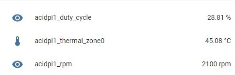
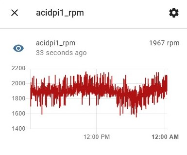
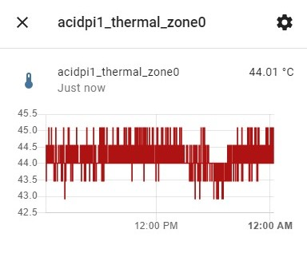

# RPi.fanspeed

Adjustable fanspeed with temperature and RPM monitoring for MQTT

## Requirements

- raspberry pi
- python 3.7
- pigpio
- paho-mqtt (only if MQTT is used)

## Installation

Edit config.sh and run setup.sh... The installation method can be set to show command line or install service.

## Configuration

The fan must be connected to one of the hardware PWM pins (12, 13, 18, 19 for RPi3B+)
The service can be configured in /etc/systemd/system/raspi_fanspeed.service using the command line arguments.

The RPM sginal can be connected to any GPIO pin.

The fan can be configured to run from 30-90°C with increasing speed. For example starting at 50°C with 30% PWM duty cycle and increasing the level up to 100% till reaching 75°C

```
# raspi_fanspeed --min 50 --max=75 --min-fan=30 -S
{
  "0.0%": "30.0°C",
  "30.0%": "50.0°C",
  "32.8%": "51.0°C",
  "35.6%": "52.0°C",
  "38.4%": "53.0°C",
  "41.2%": "54.0°C",
  "44.0%": "55.0°C",
  "46.8%": "56.0°C",
  "49.6%": "57.0°C",
  "52.4%": "58.0°C",
  "55.2%": "59.0°C",
  "58.0%": "60.0°C",
  "60.8%": "61.0°C",
  "63.6%": "62.0°C",
  "66.4%": "63.0°C",
  "69.2%": "64.0°C",
  "72.0%": "65.0°C",
  "74.8%": "66.0°C",
  "77.6%": "67.0°C",
  "80.4%": "68.0°C",
  "83.2%": "69.0°C",
  "86.0%": "70.0°C",
  "88.8%": "71.0°C",
  "91.6%": "72.0°C",
  "94.4%": "73.0°C",
  "97.2%": "74.0°C",
  "100.0%": "75.0°C"
}
```

## Temperature

The temperature is read from `sys/class/thermal/thermal_zone0/temp` by default.

## MQTT and homeassistant

When the service is running with MQTT enabled, it pushes the temperature and fan speed in intervals to topic `home/{device_name}/RPi.fanspeed/json`. `device_name` is the hostname by default.

The home assistant auto discovery prefix is set to `homeassistant` and 3 sensors should show up after starting the service.





## CLI

```
# raspi_fanspeed -h
usage: raspi_fanspeed [-h] [-i INTERVAL] [--set SET] [--measure MEASURE]
                      [--min MIN] [--max MAX] [--lin LIN] [--min-fan MIN_FAN]
                      [-p {12,13,18,19}] [--rpm-pin RPM_PIN] [-f FREQUENCY]
                      [-S] [-E ONEXIT_SPEED] [--mqttuser MQTTUSER]
                      [--mqttpass MQTTPASS] [--mqttdevicename MQTTDEVICENAME]
                      [--mqtttopic MQTTTOPIC] [--mqtthass MQTTHASS]
                      [--mqttupdateinterval MQTTUPDATEINTERVAL] [-H MQTTHOST]
                      [-P MQTTPORT] [-L LOG] [-V] [-v] [--pid PID]

adjustable fanspeed with temperature monitoring

optional arguments:
  -h, --help            show this help message and exit
  -i INTERVAL, --interval INTERVAL
                        fan speed update interval in seconds
  --set SET             set speed in %
  --measure MEASURE     measure rpm for n seconds and exit
  --min MIN             minimum temperature to turn on fan in °C
  --max MAX             maximum fan speed if temperature exceeds this value
  --lin LIN             temperature/duty cycle factor. 1.0 = linear
  --min-fan MIN_FAN     minimum fan speed in %
  -p {12,13,18,19}, --pin {12,13,18,19}
                        fan PWM pin. must be capable of hardware PWM
  --rpm-pin RPM_PIN     read RPM signal from pin
  -f FREQUENCY, --frequency FREQUENCY
                        PWM frequency
  -S, --print-speed     Print fan speed table and exit
  -E ONEXIT_SPEED, --onexit-speed ONEXIT_SPEED
                        turn fan to 30-100% when exiting. -1 disable fan on
                        exit
  --mqttuser MQTTUSER   use phyton mqtt client to connect to MQTT
  --mqttpass MQTTPASS
  --mqttdevicename MQTTDEVICENAME
                        mqtt device name
  --mqtttopic MQTTTOPIC
  --mqtthass MQTTHASS
  --mqttupdateinterval MQTTUPDATEINTERVAL
                        mqtt update interval (30-900 seconds)
  -H MQTTHOST, --mqtthost MQTTHOST
  -P MQTTPORT, --mqttport MQTTPORT
  -L LOG, --log LOG     write temperature and speed to this file i.e.
                        --log=/var/log/tempmon.json
  -V, --version
  -v, --verbose
  --pid PID
```